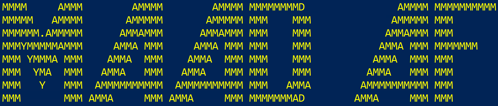

# MAAD Attack Framework
                                                                     
        
MAAD-AF is an open-source cloud attack tool developed for testing security of Microsoft 365 & Azure AD environments through adversary emulation. MAAD-AF provides security practitioners easy to use attack modules to exploit configurations across different M365/AzureAD cloud-based tools & services.

MAAD-AF is designed to make cloud security testing simple, fast and effective. Through its virtually no-setup requirement and easy to use interactive attack modules, security teams can test their security controls, detection and response capabilities easily and swiftly. 

## Features
- Pre & Post-compromise techniques
- Simple interactive use
- Virtually no-setup requirements
- Attack modules for Azure AD
- Attack modules for Exchange
- Attack modules for Teams
- Attack modules for SharePoint
- Attack modules for eDiscovery

### MAAD-AF Attack Modules
- Azure AD External Recon (Includes sub-modules)
- Azure AD Internal Recon (Includes sub-modules)
- Backdoor Account Setup
- Trusted Network Modification
- Disable Mailbox Auditing
- Disable Anti-Phishing
- Mailbox Deletion Rule Setup
- Exfiltration through Mailbox Forwarding
- Gain User Mailbox Access
- External Teams Access Setup (Includes sub-modules)
- Cross Tenant Synchronization Exploits (Includes sub-modules)
- eDiscovery exploitation (Includes sub-modules)
- Bruteforce
- MFA Manipulation
- User Account Deletion
- SharePoint exploitation (Includes sub-modules)

## Getting Started
### Plug & Play - It's that easy!
 1. Clone or download the MAAD-AF github repo to your windows host
 2. Open PowerShell as Administrator 
<<<<<<< HEAD
 3. Navigate to the local MAAD-AF directory  
 4. Run MAAD_Attack.ps1 
	 
=======
 3. Navigate to the local MAAD-AF directory 
 4. Run MAAD_Attack.ps1 
>>>>>>> 47d91696ad5083a43e4e1e75ff329d2ef403c910
```
> git clone https://github.com/vectra-ai-research/MAAD-AF.git
> cd /MAAD-AF
> ./MAAD_Attack.ps1
```

### Requirements
1. Internet accessible Windows host
2. PowerShell (version 5 or later) terminal as Administrator
3. The following PowerShell modules are required and will be installed automatically:
 - [Az](https://www.powershellgallery.com/packages/Az/) 
 - [AzureAd](https://www.powershellgallery.com/packages/AzureAD/) 
 - [MSOnline](https://www.powershellgallery.com/packages/MSOnline/) 
 - [ExchangeOnlineManagement](https://www.powershellgallery.com/packages/ExchangeOnlineManagement/)
 - [MicrosoftTeams](https://www.powershellgallery.com/packages/MicrosoftTeams/)
 - [AzureADPreview](https://www.powershellgallery.com/packages/AzureADPreview/)
 - [ADInternals](https://aadinternals.com/aadinternals/)
 - [ExchangePowershell](https://www.powershellgallery.com/packages/ExchangeOnlineManagement/3.0.0)
 - [Microsoft.Online.SharePoint.PowerShell](https://www.powershellgallery.com/packages/Microsoft.Online.SharePoint.PowerShell/16.0.23311.12000)
 - [PnP.PowerShell](https://github.com/pnp/powershell)
 - [Microsoft.Graph.Identity.SignIns](https://www.powershellgallery.com/packages/Microsoft.Graph.Identity.SignIns/2.0.0-rc3)
 - [Microsoft.Graph.Applications](https://www.powershellgallery.com/packages/Microsoft.Graph.Applications/2.0.0-rc3)
 - [Microsoft.Graph.Users](https://www.powershellgallery.com/packages/Microsoft.Graph.Users/2.0.0-rc3)
 - [Microsoft.Graph.Groups](https://www.powershellgallery.com/packages/Microsoft.Graph.Groups/2.0.0-rc3)

### Limitations
- MAAD-AF is currently only fully supported on Windows OS

## Contribute
 - Thank you for considering contributing to MAAD-AF!  
 - Your contributions will help make MAAD-AF better.
 - Join the mission to make security testing simple, fast and effective.
<<<<<<< HEAD
 - There's an ongoing efforts to make the source code more modular to enable easier contributions.
=======
 - There's an ongoing efforts to make the source code more modular.
>>>>>>> 47d91696ad5083a43e4e1e75ff329d2ef403c910
 - Submit a PR to the main branch to contribute to MAAD-AF.

### Add Custom Modules
 - Everyone is encouraged to come up with new attack modules that can be added to the MAAD-AF Library. 
 - Attack modules are functions that leverage access & privileges established by MAAD-AF to exploit configuration flaws in Microsoft services.

### Report Bugs
 - Submit bugs or other issues related to the tool directly in the "Issues" section

### Request Features
 - Share those great ideas. Submit new features by submitting a PR or sharing them in the Discussions. 

## Contact
- If you found this tool useful, want to share an interesting use-case, bring issues to attention, whatever the reason - share them. You can email at: maad-af@vectra.ai or post it in Discussions on GitHub.
